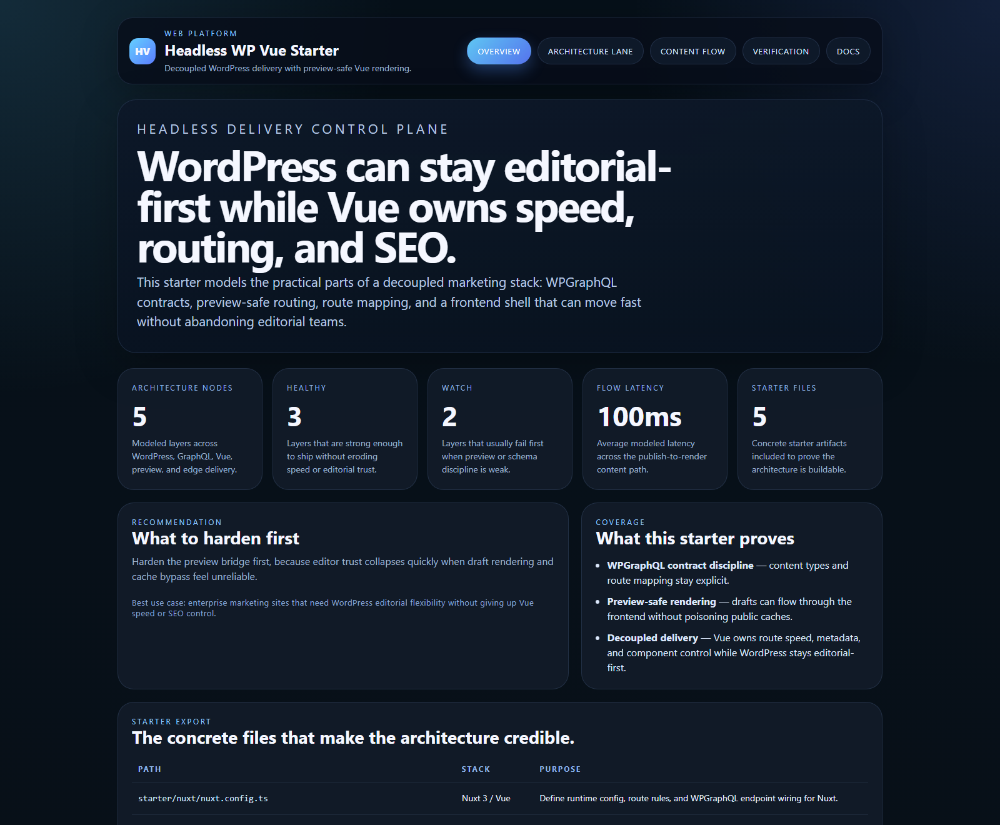
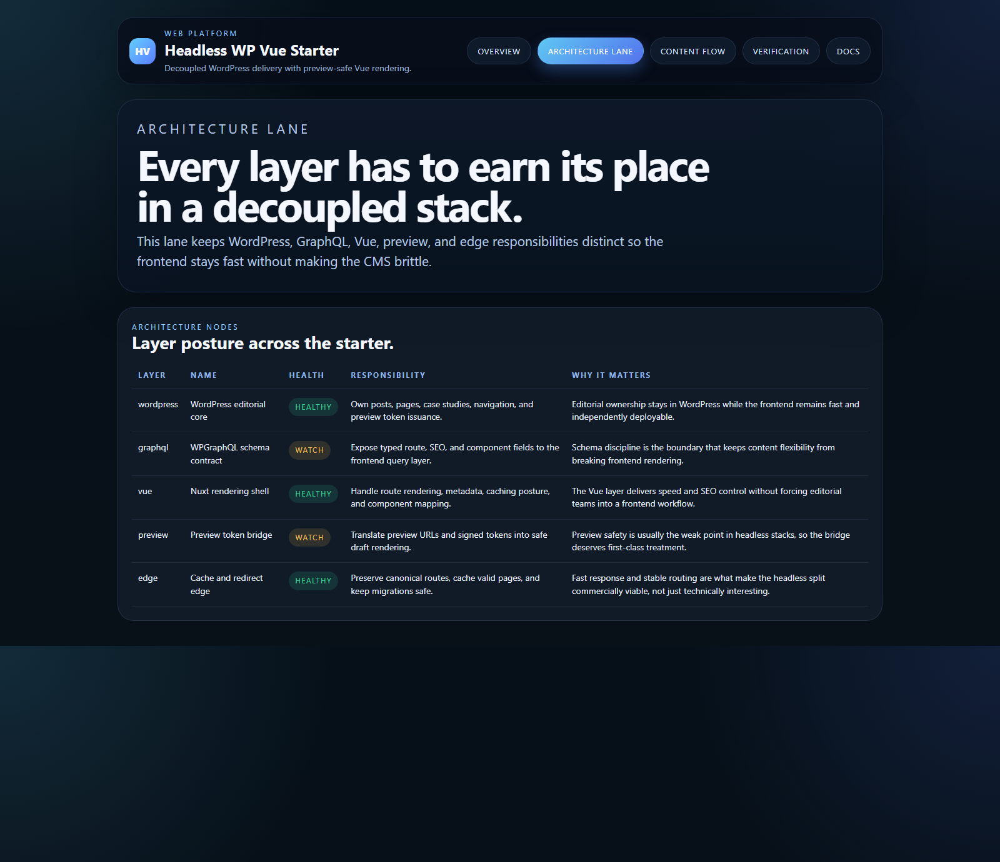
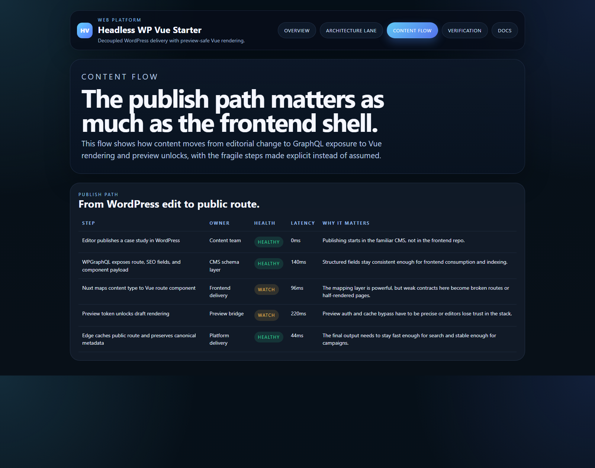
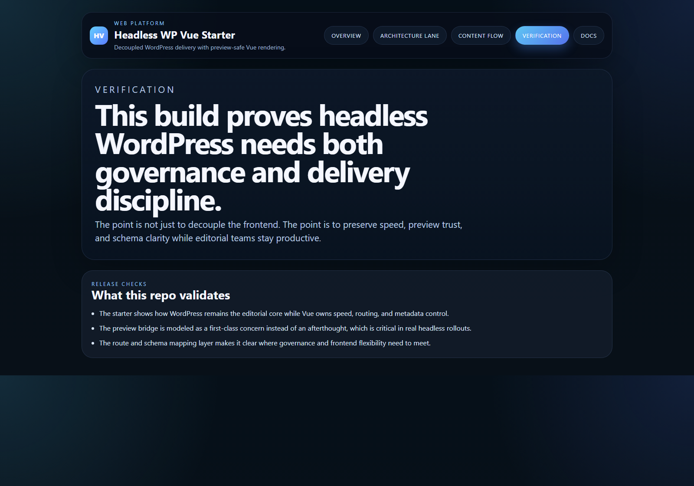

# Headless WP Vue Starter

TypeScript control plane and starter export for headless WordPress + Vue delivery, preview flow, and WPGraphQL-backed route architecture.

## Why this exists

Headless CMS projects often look clean in a pitch deck and brittle in production. By then:
- WordPress previews stop matching what editors expect
- Vue routes drift away from the schema they depend on
- metadata and route ownership become split across too many layers
- teams discover that “decoupled” only meant “harder to debug”

`headless-wp-vue-starter` models the architecture needed to keep WordPress editorial-first while Vue owns speed, route rendering, and SEO control.

## Routes

- `/`
- `/architecture-lane`
- `/content-flow`
- `/verification`
- `/docs`

## API

- `/api/dashboard/summary`
- `/api/architecture-lane`
- `/api/content-flow`
- `/api/starter-files`
- `/api/verification`
- `/api/sample`

## Screenshots






## Starter Export

- [starter/nuxt/nuxt.config.ts](./starter/nuxt/nuxt.config.ts)
- [starter/nuxt/app.vue](./starter/nuxt/app.vue)
- [starter/nuxt/server/api/preview.ts](./starter/nuxt/server/api/preview.ts)
- [starter/wordpress/wp-content/mu-plugins/headless-preview-bridge.php](./starter/wordpress/wp-content/mu-plugins/headless-preview-bridge.php)
- [starter/wpgraphql/content-map.json](./starter/wpgraphql/content-map.json)

## Local Development

```powershell
cd headless-wp-vue-starter
npm install
npm run dev
```

Open:
- [http://127.0.0.1:5384/](http://127.0.0.1:5384/)
- [http://127.0.0.1:5384/architecture-lane](http://127.0.0.1:5384/architecture-lane)
- [http://127.0.0.1:5384/content-flow](http://127.0.0.1:5384/content-flow)
- [http://127.0.0.1:5384/verification](http://127.0.0.1:5384/verification)
- [http://127.0.0.1:5384/docs](http://127.0.0.1:5384/docs)

## Validation

- `npm run build`
- `npm run test`
- `npm run demo`
- `npm run smoke`
- `npm run render:assets`

## Docs

- [Architecture](./docs/architecture.md)
- [Origin](./docs/ORIGIN.md)
- [Changelog](./CHANGELOG.md)
